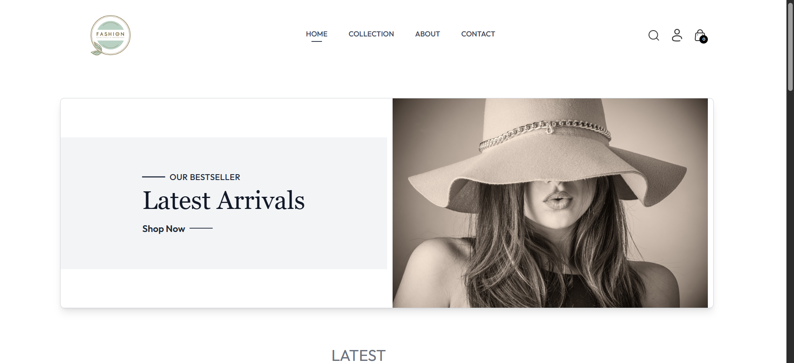
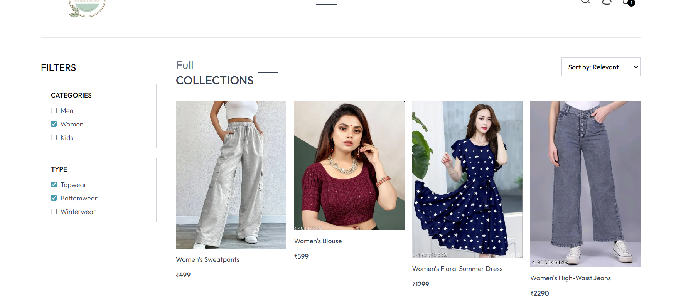

# 🛒 MERN Stack E-Commerce Website

A full-stack **E-Commerce Website** built using the MERN Stack (MongoDB, Express.js, React.js, Node.js) featuring product browsing, filtering, cart management with product variants, multiple payment options, and an admin dashboard for product management.

The project is deployed online on **Vercel** for easy access.

---

## 🚀 Live Demo

🔗 [View Live](https://e-commerce-website-frontend-1pg8.onrender.com/)

---

## 📸 Screenshots

| 🏠 Home Page | 👤 Cart Page | ➕ details Page | 
|-------------|--------------------|-----------------|
|  |  |  | 


| 💬 Chat Page | 🖼️ Post Page | 💭 Comments Page | 
|--------------|--------------|-----------------|
|  |  |  |


---

## ✨ Features

### 👥 User Features
- Browse and explore products with filters and sorting options
- Select product variants (e.g., size) before adding to cart
- Add/remove products in the cart
- Place orders with delivery address input
- Multiple payment methods: 
  - Cash on Delivery (COD) 
  - Online payment using **Stripe** and **Razorpay**
- View order history and status

### 🛠️ Admin Features
- Admin dashboard with secure login
- Add new products with images and details
- Edit or delete existing products
- View all products and orders placed on the store

---

## 🧰 Tech Stack

### 💻 Frontend
- React.js
- Tailwind CSS (optional)
- React Router DOM
- Axios for API requests

### 🖥️ Backend
- Node.js
- Express.js
- MongoDB with Mongoose
- Stripe & Razorpay payment gateways
- JWT Authentication (optional for secure admin/user access)

---

## 📂 Folder Structure

```bash
ecommerce-app/
├── backend/          # Node.js + Express API
│   ├── controllers/  # Business logic
│   ├── models/       # MongoDB schemas
│   ├── routes/       # API routes
│   ├── middleware/   # Auth and validation middleware
│   └── server.js     # Entry point
│
├── frontend/         # React frontend
│   ├── public/
│   └── src/
│       ├── components/
│       ├── pages/
│       ├── context/
│       ├── App.js
│       ├── main.jsx
│
└── README.md

```

---

## 🧰 Local Setup Instructions

### ✅ Requirements:
- Node.js installed
- MongoDB connection ( Atlas)

- Vite (comes with frontend)

---

### 1️⃣ Backend Setup

```bash
cd backend
npm install
```

Create a `.env` file in `/backend`:

```env
MONGO_URI=your_mongodb_connection_string
JWT_SECRET=your_jwt_secret_key
STRIPE_SECRET_KEY=your_stripe_secret_key
RAZORPAY_KEY_ID=your_razorpay_key_id
RAZORPAY_KEY_SECRET=your_razorpay_key_secret


```

Start the server:

```bash
npm start
```

---

### 2️⃣ Frontend Setup

```bash
cd ../frontend
npm install
```

Create a `.env` file in `/frontend`:

```env
VITE_BACKEND_URL=http://localhost:5000
VITE_STRIPE_PUBLIC_KEY=your_stripe_public_key
VITE_RAZORPAY_KEY_ID=your_razorpay_key_id


```

Start the frontend:

```bash
npm run dev
```

> Frontend runs at `http://localhost:5173`

---

## 👨‍💻 Author

**Yash Rana**  
🎓 IET Lucknow  
📧 yashrana097@gmail.com  
🔗 [LinkedIn](https://www.linkedin.com/in/yashrana52)  
💻 [GitHub](https://github.com/YashRana52)
